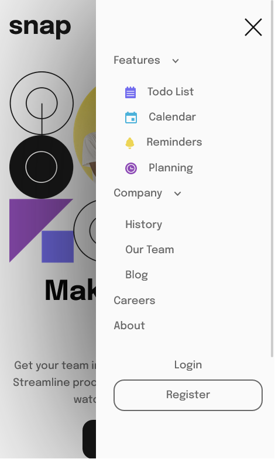

# Frontend Mentor - Intro section with dropdown navigation solution

This is a solution to the [Intro section with dropdown navigation challenge on Frontend Mentor](https://www.frontendmentor.io/challenges/intro-section-with-dropdown-navigation-ryaPetHE5). Frontend Mentor challenges help you improve your coding skills by building realistic projects.

## Table of contents

- [Overview](#overview)
  - [The challenge](#the-challenge)
  - [Screenshots](#screenshots)
  - [Links](#links)
- [My process](#my-process)
  - [Built with](#built-with)
  - [What I learned](#what-i-learned)
  - [Continued development](#continued-development)
  - [Useful resources](#useful-resources)
- [Author](#author)

## Overview

### The challenge

Users should be able to:

- View the relevant dropdown menus on desktop and mobile when interacting with the navigation links
- View the optimal layout for the content depending on their device's screen size
- See hover states for all interactive elements on the page

### Screenshots

#### Desktop View

#### Desktop View Hover States

#### Mobile View

#### Mobile View Menu

### Links

- Solution URL: [GitHub repo](https://github.com/shivaprakash-sudo/intro-section-with-dropdown-menu)
- Live Site URL: [Intro Section With Dropdown Navigation](https://shivaprakash-sudo.github.io/intro-section-with-dropdown-menu/)

## My process

### Built with

- Semantic HTML5 markup
- CSS custom properties
- Flexbox
- Mobile-first workflow
- SASS/SCSS

## Author

- Frontend Mentor - [@shivaprakash-sudo](https://www.frontendmentor.io/profile/shivaprakash-sudo)
